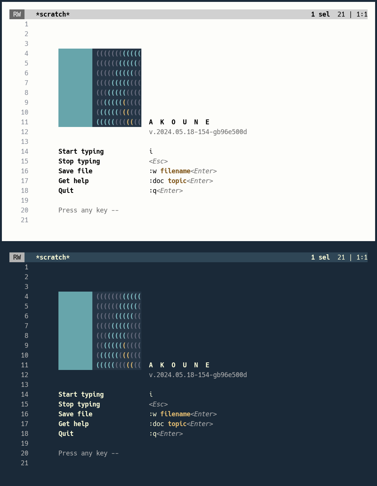

# texture.kak

A Kakoune splash screen with a textured logo.

This plugin is an alternative to [splash.kak](https://github.com/ftonneau/splash.kak).
Two issues with splash.kak are worth mentioning.

First, the triangular parts of the splash.kak logo involve UTF-8 characters that
are guaranteed to match rectangular cell height only on a VTE-based terminal
(where they are drawn as actual geometric shapes). Other terminals will draw
these characters as text, with potentially desastrous results unless one relies
on special fonts (as in [this solution](https://github.com/Hjagu09/splash.kak) by
[Hjagu09](https://github.com/Hjagu09)).

Second, even on VTE-based terminals and/or with an adequate font, the splash.kak
logo looks good only within a narrow range of combinations of cell width and height
(combinations which depend both on the terminal and on the chosen font). Outside of
this narrow range, the letter K that the logo represents will look distorted.

Texture **eliminates these problems** by:

- relying only on plain ASCII characters.
- allowing the width/height ratio of the logo to be adjusted.

The texture splash screen can be used on a light or dark background, depending
on your current colorscheme.

# Installation

Download [texture.kak](./texture.kak) and copy it somewhere in your autoload
directory tree.

# Color configuration

The **colors of the K logo** can be configured via the following options:

- `texture_trunk_color` for the trunk (i.e., the rectangular part of the K letter)
- `texture_fork_color` for the upward diagonal in the K letter
- `texture_limb_color` for the smaller, downward diagonal 
- `texture_tile_color` for the tile elements outside of the letter
- `texture_pane_color` for the background behind the tiles

Two **text colors** can also be configured. In this case, however, and contrary
to the logo, the colors are supposed to differ depending on terminal background:

- `texture_dim_light` for faded text in a light terminal
- `texture_dim_dark` for faded text in a dark terminal

- `texture_hot_light` for vivid text in a light terminal
- `texture_hot_dark` for vivid text in a dark terminal

Each color you specify must be a named color (e.g., `red`) or be in the `rgb:RRGGBB`
format.

# Configuration 

A single command, `texture VARIANT WIDTH`, allows you to activate the splash screen
with the configuration you desire. There are two arguments to `texture`:

- the first argument, `VARIANT`, must be either `light` or `dark`, depending on the
type of terminal background you want to use.

- the second argument, `WIDTH`, must be an integer from 1 to 8. A larger
integer value corresponds to a wider/thicker logo shape. You should probably
try a few values and pick the one that gives better results (meaning, a logo
that looks **approximately square** in your terminal with your chosen font).

## Note

The colors in the screenshot above were chosen to match the light and dark
[tangere-terminal](https://github.com/ftonneau/tangere-terminal) colorschemes.
The font is [Hack](https://github.com/source-foundry/Hack), and the texture
logo runs with a `WIDTH` parameter equals to 5.

